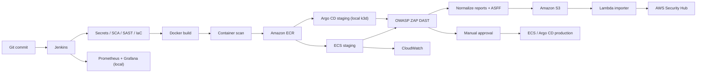

# DevSecOps Factory on AWS

Dự án tích hợp mã nguồn của Task 1–4 thành một luồng hoàn chỉnh trên branch
`cicd-gitops`: React Tetris → Jenkins security gates → Docker → Amazon ECR →
ECS Fargate staging → S3/Lambda/Security Hub → manual approval → ECS Fargate
production. Argo CD và k3d cung cấp đường GitOps local; Prometheus/Grafana cung
cấp quan sát local, còn CloudWatch nhận log và Container Insights trên AWS.

> This repository combines Tasks 1–4 into one runnable DevSecOps workflow.
> Vietnamese is the primary operational language; the English summary is below.

## Kiến trúc



## Phần đã tích hợp

| Phạm vi | Thành phần chính |
|---|---|
| Task 1 – AWS | Terraform cho Budget, IAM, ECR, VPC, ALB, ECS Fargate, S3, CloudWatch và Lambda/Security Hub tùy chọn |
| Task 2 – CI/CD | Jenkins pipeline 21 stage, ECR, ECS, GitOps, S3, production approval và immutable SHA tag |
| Task 3 – Security | Gitleaks, Trivy, SonarQube, Checkov, ZAP, schema report thống nhất và ASFF |
| Task 4 – App | React app, multi-stage Dockerfile, hardened Kustomize overlays và ECS task-definition mẫu |
| Hoàn thiện chung | Compose thống nhất, Prometheus/Grafana/Blackbox, test report pipeline, validation và cleanup scripts |

## Chạy local

Yêu cầu: Docker Desktop/Engine, `make`, `kubectl`, Python 3 và tối thiểu 8 GB
RAM khả dụng nếu chạy cả Jenkins lẫn SonarQube.

```bash
make setup-env
# Sửa .env và thay toàn bộ giá trị change-me-before-use.
make up
make status
```

Các URL mặc định:

- Jenkins: <http://localhost:8080>
- SonarQube: <http://localhost:9000>
- Prometheus: <http://localhost:9090>
- Grafana: <http://localhost:3000>
- Docker Registry: `localhost:5001`

Chạy riêng từng lớp:

```bash
make up-infra
make up-security
make up-obs
```

## GitOps local với k3d

```bash
make k3d-create
make k3d-configure
make argocd-install
kubectl apply -f cd/apps/staging.yaml
kubectl apply -f cd/apps/production.yaml
```

Thêm vào `/etc/hosts` nếu hệ điều hành không tự ánh xạ `.localhost`:

```text
127.0.0.1 tetris-staging.localhost tetris.localhost
```

Argo CD đang trỏ tới repository/branch khai báo trong `cd/apps/*.yaml`. Hãy đổi
`repoURL` nếu bản tích hợp được đẩy sang repository khác.

## Jenkins

Tạo Multibranch Pipeline hoặc Pipeline from SCM với script path
`ci/Jenkinsfile`. Build mặc định an toàn cho local:

- `REGISTRY_TARGET=local`
- `SECURITY_MODE=stub`
- các side effect AWS/GitOps mặc định tắt

Jenkins dùng Docker-in-Docker cô lập trên network `devsecops`; controller không
chạy bằng root và không gắn Docker socket của máy host. Docker engine vẫn chạy
privileged bên trong Docker Desktop VM, vì vậy chỉ khởi động stack từ source đã
tin cậy và dừng stack khi kết thúc demo.

`ci/jenkins-job.xml` dùng bản clone local được mount read-only tại
`/workspace/source`, phù hợp khi GitHub repository là private nhưng chưa cấp PAT
cho Jenkins. Muốn dùng webhook/SCM trực tiếp, đổi URL trong job sang GitHub và
gắn credential `github-token`.

Luồng demo kỹ thuật đầy đủ dùng:

- `DEMO_PRESET=FULL_PROJECT_DEMO` khi chạy qua `scripts/demo-trigger.sh`
- `REGISTRY_TARGET=ecr`
- `IMAGE_PLATFORM=linux/amd64` cho ECS Fargate mặc định
- `SECURITY_MODE=enforce`
- `SECURITY_BLOCK_SEVERITIES=CRITICAL` (hoặc `CRITICAL,HIGH`)
- `ENABLE_SAST=true` với SonarQube token trong Jenkins Credentials
- `ENABLE_ECS_DEPLOY=true`
- `ENABLE_DAST=true`, `DAST_GATE_MODE=report-only` và `STAGING_URL` là URL ALB staging
- `ENABLE_S3_UPLOAD=true`
- `ENABLE_SECURITY_HUB_IMPORT=true` sau khi Terraform bật Lambda importer
- `ENABLE_GITOPS_UPDATE=true` và mirror image sang local registry cho k3d/Argo CD
- `PROMOTE_PRODUCTION=true` để chờ manual approval

Pipeline dùng một tag 12 ký tự từ commit SHA cho cả staging và production.
Không ghi AWS key, GitHub token hoặc Sonar token vào repository.

### Demo AWS lặp lại

Jenkins checkout commit từ branch local, vì vậy hãy commit thay đổi trước khi
demo; không cần push GitHub. Giữ named volumes để cache Jenkins history,
Checkov, ZAP, Gitleaks và Trivy. Không dùng `docker compose down -v`.

```bash
cd /Users/loibui/Downloads/devsecops-factory/task-2
aws sso login --profile devsecops-factory
docker compose -f docker-compose.infra.yml up -d --build
make gitops-seed

# Đưa hai ECS service về desired count 0, không destroy Terraform:
AWS_PROFILE_NAME=devsecops-factory make demo-reset

# Tự đọc Terraform outputs và trigger preset đầy đủ:
make demo-trigger

# Chỉ kiểm tra preset/outputs, không trigger full build:
./scripts/demo-trigger.sh --dry-run
```

`demo-trigger` tự điền ECR, S3 bucket, staging URL, ECS family/cluster,
security enforce, SAST, DAST report-only, S3/Lambda/Security Hub, local GitOps
mirror và production manual gate. Script chỉ in URL console/gate, không in
Jenkins password hoặc AWS key. Nếu Jenkins chưa biết parameter mới, script tự
chạy một seed build local-safe trước. Khi kết thúc:

```bash
AWS_PROFILE_NAME=devsecops-factory make demo-reset
docker compose -f docker-compose.infra.yml down
```

## Triển khai AWS

Không chạy `terraform apply` trước khi xem chi phí và xác nhận email Budget:

```bash
cd infrastructure/terraform
cp terraform.tfvars.example terraform.tfvars
terraform init
terraform fmt -check
terraform validate
terraform plan -out=tfplan
terraform apply tfplan
terraform output
```

Các task ECS mặc định bằng `0` để tránh phí Fargate ngoài giờ demo. Jenkins sẽ
scale chúng khi deploy, hoặc dùng:

```bash
scripts/scale-ecs.sh up
scripts/scale-ecs.sh down
```

`enable_security_hub_importer=false` theo mặc định. Chỉ chuyển thành `true` nếu
muốn bật Security Hub và Lambda S3 trigger. Gắn output
`jenkins_ci_policy_arn` vào IAM principal của Jenkins; ưu tiên IAM role/default
credential chain thay vì access key dài hạn.

### Tắt hoàn toàn sau demo

Có hai mức cleanup khác nhau:

- `make demo-reset` chỉ đưa ECS staging/production về `desiredCount=0`. Cách này
  phù hợp khi sắp demo lại, nhưng hai ALB, ECR, S3 và tài nguyên khác vẫn tồn tại
  và một số dịch vụ vẫn có thể tính phí.
- `terraform destroy` xoá hạ tầng AWS của dự án. Hãy dùng cách này khi kết thúc
  buổi demo và muốn ngăn chi phí mới từ các tài nguyên đó.

Quy trình dưới đây xoá ECS, ALB, ECR cùng toàn bộ image, S3 cùng report,
CloudWatch log group, VPC, IAM Jenkins, Budget và các tài nguyên Terraform liên
quan. S3 report, ECR image và Jenkins AWS access key sẽ không thể khôi phục.

#### 1. Ngăn Jenkins tạo deployment mới và tắt local stack

Đảm bảo không có Jenkins build đang chạy hoặc đang chờ nút production gate, rồi
chạy:

```bash
cd /Users/loibui/Downloads/devsecops-factory/task-2

# Chạy cả bốn lệnh là an toàn dù trước đó chỉ bật một phần stack.
docker compose -f docker-compose.infra.yml down --remove-orphans
docker compose -f docker-compose.security.yml down --remove-orphans
docker compose -f docker-compose.obs.yml down --remove-orphans
docker compose down --remove-orphans

# Xoá riêng cluster Kubernetes local nếu đã tạo.
make k3d-delete
```

Không thêm `-v` nếu muốn giữ Jenkins history, scanner cache và dữ liệu local cho
lần demo sau. Named volume nằm trên máy cá nhân và không phát sinh phí AWS.

#### 2. Đăng nhập và kiểm tra đúng AWS account

```bash
aws sso login --profile devsecops-factory
aws sts get-caller-identity --profile devsecops-factory
```

Kiểm tra trường `Account` là account đã dùng để demo. Với môi trường hiện tại,
Account ID phải là `585572506644` (bốn số cuối `6644`). Không tiếp tục nếu ID
khác, vì `terraform destroy` sẽ thao tác trên account đang đăng nhập.

#### 3. Xem destroy plan và xoá toàn bộ AWS project

Chạy cleanup script từ thư mục gốc repository:

```bash
AWS_PROFILE=devsecops-factory \
EXPECTED_AWS_ACCOUNT_ID=585572506644 \
CONFIRM_AWS_CLEANUP=devsecops-factory \
DESTROY_TERRAFORM=true \
./scripts/cleanup-aws.sh
```

Script sẽ scale ECS về `0`, hiển thị Terraform destroy plan và chờ xác nhận.
Đọc dòng tổng kết: plan phải có `0 to add`, `0 to change` và chỉ có tài nguyên
`to destroy`. Nhập chính xác `yes` để tiếp tục. Có thể mất 5–15 phút vì AWS cần
drain ECS và thu hồi network interface trước khi xoá ALB/VPC.

Terraform đã bật `force_delete` cho ECR và `force_destroy` cho IAM Jenkins, nên
image cùng access key do Jenkins dùng cũng được thu hồi. Sau khi Terraform hoàn
tất, script deregister các revision `tetris-app` do Jenkins tạo ngoài Terraform
và chỉ thành công khi Terraform state đã rỗng.

#### 4. Kiểm tra kết quả

Lệnh đầu tiên phải không in tài nguyên nào. Các lệnh AWS còn lại phải trả về
`[]` hoặc `0`:

```bash
terraform -chdir=infrastructure/terraform state list

aws elbv2 describe-load-balancers \
  --profile devsecops-factory --region ap-southeast-1 \
  --query "LoadBalancers[?contains(LoadBalancerName, 'devsecops-factory')].LoadBalancerName"

aws ecs list-clusters \
  --profile devsecops-factory --region ap-southeast-1 \
  --query "clusterArns[?contains(@, 'devsecops-factory')]"

aws ecs list-task-definitions \
  --profile devsecops-factory --region ap-southeast-1 \
  --family-prefix tetris-app --status ACTIVE \
  --query "length(taskDefinitionArns)"

aws ecr describe-repositories \
  --profile devsecops-factory --region ap-southeast-1 \
  --query "repositories[?contains(repositoryName, 'devsecops')].repositoryName"

aws s3api list-buckets \
  --profile devsecops-factory \
  --query "Buckets[?starts_with(Name, 'devsecops-reports-')].Name"

aws ec2 describe-vpcs \
  --profile devsecops-factory --region ap-southeast-1 \
  --filters Name=tag:Name,Values=devsecops-factory-vpc \
  --query "Vpcs[].VpcId"

docker ps -a --format '{{.Names}}' |
  grep -E '^(jenkins|devsecops-docker-engine|local-registry|sonarqube|prometheus|grafana|blackbox-exporter|k3d-devsecops)' |
  wc -l
```

AWS Cost Explorer có độ trễ, vì vậy chi phí đã phát sinh trước lúc destroy vẫn
có thể xuất hiện sau đó. Destroy ngăn tài nguyên dự án tiếp tục tạo chi phí mới;
nó không xoá chi phí đã sử dụng và không tác động tới tài nguyên khác trong
account.

#### 5. Chuẩn bị cho lần demo tiếp theo

Sau full destroy, chạy lại Terraform `plan`/`apply` trong mục **Triển khai AWS**.
IAM user Jenkins sẽ được tạo lại nhưng access key cũ trong `.env` đã bị thu hồi.
Hãy tạo access key mới cho output `jenkins_ci_user_name`, cập nhật
`AWS_ACCESS_KEY_ID` và `AWS_SECRET_ACCESS_KEY` trong `.env`, rồi khởi động
Jenkins. Không tái sử dụng hoặc chia sẻ access key cũ.

## Kiểm thử

```bash
scripts/validate.sh
FULL_BUILD=true scripts/validate.sh
```

Script kiểm tra shell, Python report/ASFF, Kustomize, Docker Compose, JSON và
Terraform. `FULL_BUILD=true` chạy thêm `npm ci` và build ứng dụng.

## Giới hạn đã biết

- Frontend giữ `react-scripts@3.4.0` và một số dependency cũ để phục vụ demo
  SCA; xem `app/VULNERABILITIES.md`. Đây không phải baseline phù hợp cho
  production thật.
- Repository không chứa `.env`, Terraform state, AWS key, GitHub token hay
  kubeconfig. Các giá trị này phải được cấp qua `.env`, Jenkins Credentials,
  IAM role/SSO hoặc secret manager.
- Terraform tạo hai ALB theo yêu cầu staging/production. Đây là phần có thể phát
  sinh phí ngay cả khi ECS desired count bằng `0`.
- Ảnh trong `results/` là bằng chứng lịch sử của từng task; kết quả tích hợp cuối
  nên được chụp lại sau khi chạy trên tài khoản AWS đích.

## English summary

The integrated branch provides a local-safe stack and an opt-in AWS release
path. Start locally with `make setup-env && make up`; validate with
`scripts/validate.sh`. Provision AWS only after reviewing the Terraform plan.
ECS tasks start at zero, Jenkins promotes an immutable commit-tagged image, and
production requires manual approval. Security reports are normalized, uploaded
to S3, and can be imported into Security Hub by an optional Lambda trigger.
