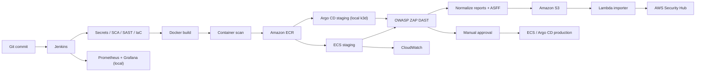

# DevSecOps Factory on AWS

```text
React Tetris
  -> Jenkins security gates
  -> Docker/ECR
  -> ECS staging + local GitOps staging
  -> ZAP DAST
  -> S3/Lambda/Security Hub
  -> manual approval
  -> ECS production + local GitOps production
```

## Kiến trúc



| Mục tiêu | Lệnh chính |
|---|---|
| Chỉ kiểm tra source/config | `scripts/validate.sh` |
| Khởi động toàn bộ nền tảng local | `make bootstrap` |
| Chạy pipeline hoàn chỉnh local + AWS | `make demo-trigger` sau khi chuẩn bị AWS |
| Tắt local nhưng giữ dữ liệu | `make down` và `k3d cluster stop devsecops` |
| Đưa hai ECS service về 0 | `AWS_PROFILE_NAME=devsecops-factory make demo-reset` |
| Xóa hẳn tài nguyên AWS | Quy trình **Xóa toàn bộ AWS** ở cuối README |

`make bootstrap` chỉ dựng nền tảng local và không tạo hạ tầng AWS.
`make demo-trigger` mới chạy preset tích hợp đầy đủ, do đó cần Terraform outputs
và AWS credentials hợp lệ.

## Yêu cầu

- macOS/Linux hoặc WSL2; cấu hình hiện tại đã được kiểm chứng trên macOS với
  Docker Desktop.
- Docker Desktop/Engine, Git và GNU Make.
- `kubectl`, `helm` và `k3d` cho Kubernetes/Argo CD local.
- Python 3, `jq`, `curl` và Terraform 1.x.
- AWS CLI v2 với profile `devsecops-factory` cho luồng AWS.
- Node.js/npm chỉ bắt buộc khi build frontend trực tiếp trên máy host.
- Cần kết nối Internet ở lần đầu để tải container images, Helm chart,
  Terraform providers và Argo CD manifests.
- Khuyến nghị 10–12 GB RAM và ít nhất 25 GB dung lượng trống cho Docker. Lần
  chạy đầu cần tải Jenkins, SonarQube, k3d và image OWASP ZAP khá lớn.
- Các cổng cần trống: `80`, `443`, `3000`, `5001`, `6443`, `8080`, `9000`,
  `9090` và `9418`.

Kiểm tra nhanh:

```bash
docker version
git --version
make --version
kubectl version --client
helm version
k3d version
terraform version
aws --version
jq --version
python3 --version
```

## 1. Chuẩn bị lần đầu

Luôn chạy lệnh từ thư mục root. Hai Argo CD Application local hiện theo dõi
branch `cicd-gitops`, vì vậy hãy dùng đúng branch, còn không thì modify code nhé

```bash
cd /Users/loibui/Downloads/devsecops-factory/task-2
git switch cicd-gitops
make setup-env
```

Mở `.env` và thay placeholder. Không commit file này. Local platform cần tối
thiểu:

```dotenv
JENKINS_ADMIN_PASS=<mật-khẩu-mạnh>
GRAFANA_ADMIN_PASSWORD=<mật-khẩu-mạnh>
```

Preset `FULL_PROJECT_DEMO` cần thêm:

```dotenv
SONAR_TOKEN=<token-từ-SonarQube>
AWS_ACCESS_KEY_ID=<access-key-của-IAM-Jenkins>
AWS_SECRET_ACCESS_KEY=<secret-key-của-IAM-Jenkins>
```

`GITHUB_TOKEN` không bắt buộc cho demo hiện tại vì Jenkins và Argo CD dùng Git
remote local `gitops-git-server`. Không in nội dung `.env` ra terminal công
khai hoặc đưa nó vào ảnh minh chứng.

Nếu cần tạo Sonar token lần đầu:

1. Chạy `make up-security`.
2. Mở <http://localhost:9000>, hoàn tất đăng nhập/quản trị và tạo token.
3. Cập nhật `SONAR_TOKEN` trong `.env`.
4. Sau khi Jenkins được bật, chạy `docker compose restart jenkins` để JCasC nạp
   credential mới.

## 2. Khởi động toàn bộ nền tảng local

Sau khi `.env` đã sẵn sàng:

```bash
make bootstrap
make status
```

`make bootstrap` thực hiện:

1. Tạo Docker network và bật Jenkins, Docker-in-Docker, local registry,
   SonarQube, Prometheus, Grafana và Blackbox Exporter.
2. Tạo mới hoặc khởi động lại cluster k3d `devsecops`.
3. Cài ingress-nginx và Argo CD.
4. Seed branch hiện tại vào Git remote local.
5. Tạo Argo CD Application staging và production.

Lần đầu có thể mất vài phút. Kiểm tra platform:

```bash
docker compose ps
export KUBECONFIG="$HOME/.kube/devsecops-local.kubeconfig"
kubectl get pods -A
kubectl get applications -n argocd
```

Các URL mặc định:

- Jenkins: <http://localhost:8080>
- SonarQube: <http://localhost:9000>
- Prometheus: <http://localhost:9090>
- Grafana: <http://localhost:3000>
- Docker Registry: `localhost:5001`
- Tetris staging: <http://tetris-staging.localhost>
- Tetris production: <http://tetris-production.localhost>

Muốn mở Argo CD UI, chạy lệnh dưới đây trong một terminal riêng rồi truy cập
<http://localhost:8443>:

```bash
export KUBECONFIG="$HOME/.kube/devsecops-local.kubeconfig"
kubectl port-forward -n argocd svc/argocd-server 8443:80
```

Username mặc định là admin, còn mật khẩu lấy từ secret Kubernetes bằng lệnh sau trên macOS:

```bash
export KUBECONFIG="$HOME/.kube/devsecops-local.kubeconfig"

kubectl -n argocd get secret argocd-initial-admin-secret \
  -o jsonpath='{.data.password}' | base64 -D

echo
```

Nếu `.localhost` không được hệ điều hành tự phân giải, thêm:

```text
127.0.0.1 tetris-staging.localhost tetris-production.localhost
```

Trên một máy hoàn toàn mới, hai Tetris Deployment có thể tạm thời báo
`ImagePullBackOff` vì local registry chưa có image. Pipeline
`FULL_PROJECT_DEMO` sẽ build, scan, mirror image vào registry và cập nhật
GitOps bằng immutable SHA tag.

Muốn bật riêng từng lớp:

```bash
make up-infra
make up-security
make up-obs
```

## 3. Kiểm thử source và cấu hình

```bash
scripts/validate.sh
FULL_BUILD=true scripts/validate.sh
```

Lệnh đầu kiểm tra shell, Python report/ASFF, Kustomize, Docker Compose, JSON,
monitoring và Terraform. Lệnh thứ hai chạy thêm `npm ci` và production build
của React app.

## 4. Chuẩn bị hạ tầng AWS

Nếu hạ tầng đã tồn tại, không apply lại đại: đăng nhập và chạy
`terraform plan`; kết quả mong đợi là `No changes`.

```bash
aws sso login --profile devsecops-factory
AWS_PROFILE=devsecops-factory \
  terraform -chdir=infrastructure/terraform plan
```

Nếu đây là account/môi trường mới, tạo `terraform.tfvars` và review plan trước
khi apply:

```bash
aws sso login --profile devsecops-factory
export AWS_PROFILE=devsecops-factory
aws sts get-caller-identity --profile devsecops-factory

test -e infrastructure/terraform/terraform.tfvars || \
  cp infrastructure/terraform/terraform.tfvars.example \
    infrastructure/terraform/terraform.tfvars

# Sửa email Budget và bật hai tùy chọn sau để chạy đủ luồng:
# enable_security_hub_importer = true
# create_local_jenkins_user     = true

terraform -chdir=infrastructure/terraform init
terraform -chdir=infrastructure/terraform fmt -check
terraform -chdir=infrastructure/terraform validate
terraform -chdir=infrastructure/terraform plan -out=tfplan
terraform -chdir=infrastructure/terraform apply tfplan
terraform -chdir=infrastructure/terraform output
```

Terraform không quản lý access key. Nếu dùng Jenkins local, tạo một access key
cho IAM user từ output `jenkins_ci_user_name`, đưa key vào `.env`, rồi restart
Jenkins để JCasC cập nhật credential `aws-credentials`. Không commit, chia sẻ
hoặc lưu key trong ảnh minh chứng. Jenkins chạy trong AWS nên dùng IAM
role/default credential chain thay cho key dài hạn.

Giữ `staging_desired_count` và `production_desired_count` bằng `0` ngoài thời
gian demo. Hai ALB vẫn có thể phát sinh phí dù ECS đã scale về 0.

## 5. Chạy pipeline end-to-end

Jenkins checkout source đã commit trong branch hiện tại. Trước khi chạy, bảo
đảm working tree sạch, local platform đang bật, Terraform outputs tồn tại và
AWS credentials trong `.env` còn hiệu lực:

```bash
git status --short
make up
make k3d-create
make gitops-seed
make argocd-apps

aws sso login --profile devsecops-factory
AWS_PROFILE_NAME=devsecops-factory make demo-reset

# Chỉ preflight, chưa tạo Jenkins build: (action này yêu cầu working tree sạch, push all changes)
./scripts/demo-trigger.sh --dry-run

# Trigger preset FULL_PROJECT_DEMO:
make demo-trigger
```

`demo-trigger.sh` tự tạo Jenkins job nếu chưa có và đọc ECR, ECS, S3, ALB cùng
Lambda từ Terraform outputs. Luồng gồm 22 stage:

```text
checkout/validate
  -> Gitleaks + Trivy SCA + SonarQube + Checkov
  -> Docker build + container scan
  -> ECR push + local registry mirror
  -> GitOps staging + ECS staging
  -> ZAP DAST
  -> normalize reports + ASFF + S3 + Lambda/Security Hub
  -> manual production approval
  -> GitOps production + ECS production
  -> summary/archive artifacts
```

Terminal sẽ in URL console và manual gate. Mở Jenkins, đợi stage
`19. Production Approval`, kiểm tra staging rồi chọn **Proceed** trong vòng 30
phút. Lần đầu thường lâu hơn do tải scanner/cache, đặc biệt là OWASP ZAP.

## 6. Xác minh sau pipeline

```bash
export KUBECONFIG="$HOME/.kube/devsecops-local.kubeconfig"
kubectl get applications -n argocd
kubectl get deploy,pod,ingress -n staging
kubectl get deploy,pod,ingress -n production

curl -I http://tetris-staging.localhost
curl -I http://tetris-production.localhost

aws ecs describe-services \
  --profile devsecops-factory \
  --region ap-southeast-1 \
  --cluster devsecops-factory-cluster \
  --services tetris-staging tetris-production \
  --query 'services[].{service:serviceName,desired:desiredCount,running:runningCount,taskDefinition:taskDefinition}'

terraform -chdir=infrastructure/terraform output -raw alb_dns_staging
terraform -chdir=infrastructure/terraform output -raw alb_dns_production
```

Kết quả mong đợi:

- Jenkins build `SUCCESS`, đủ 22 stage và artifacts trong `scan-reports/`.
- Hai Argo CD Application ở trạng thái `Synced` và `Healthy`.
- Hai URL local trả HTTP `200`.
- ECR có image với tag 12 ký tự của commit.
- ECS staging/production chạy task definition mới sau promotion.
- S3 có security reports; Lambda chạy không lỗi; Security Hub nhận findings.
- Prometheus targets đều `UP`; Grafana dashboard hiển thị availability.

## 7. Dừng sau khi demo

Scale ECS về 0 trước để giảm chi phí, rồi dừng local. Không dùng `-v` nếu muốn
giữ Jenkins history, SonarQube data và scanner cache:

```bash
AWS_PROFILE_NAME=devsecops-factory make demo-reset
make down
k3d cluster stop devsecops
```

`make down` không xóa named volumes. `make clean` xóa container local và
cluster k3d nhưng không destroy AWS.

## Jenkins và bảo mật runtime

Build mặc định an toàn cho local dùng `REGISTRY_TARGET=local`,
`SECURITY_MODE=stub` và tắt side effect AWS/GitOps. Demo đầy đủ dùng
`SECURITY_MODE=enforce`, chặn `CRITICAL`, bật SAST/DAST, ECR/ECS,
S3/Lambda/Security Hub, local GitOps mirror và production approval.

Jenkins dùng Docker-in-Docker cô lập trên network `devsecops`; controller không
gắn Docker socket host. Docker engine vẫn chạy privileged bên trong Docker
Desktop VM, vì vậy chỉ chạy source tin cậy và dừng stack sau demo.

`ci/jenkins-job.xml` checkout bản clone local được mount read-only tại
`/workspace/source`; thay đổi chưa commit sẽ không được pipeline nhìn thấy và
`demo-trigger.sh` chủ động từ chối working tree bẩn. Pipeline dùng cùng một
immutable SHA tag cho staging và production.

## Lỗi thường gặp

| Hiện tượng | Kiểm tra/cách xử lý |
|---|---|
| `permission denied` với Docker socket | Mở Docker Desktop và chờ engine sẵn sàng |
| Cổng đã được sử dụng | Dùng `lsof -nP -iTCP:<port> -sTCP:LISTEN`, rồi dừng dịch vụ xung đột |
| Jenkins chưa healthy | `make logs SVC=jenkins`; lần build image đầu có thể mất vài phút |
| SonarQube chưa sẵn sàng | `make logs SVC=sonarqube`; kiểm tra RAM Docker và token trong `.env` |
| `demo-trigger` báo working tree bẩn | Commit thay đổi cần chạy; Jenkins chỉ checkout nội dung đã commit |
| `demo-trigger` báo thiếu Terraform output | Chạy `terraform init/plan/apply` và bật Security Hub importer |
| AWS credential lỗi trong Jenkins | Cập nhật `.env`, kiểm tra IAM key còn hiệu lực, rồi restart Jenkins |
| Argo CD app `OutOfSync`/`Unknown` | `make gitops-seed`, `make argocd-apps`, rồi xem controller logs |
| Pod `ImagePullBackOff` | Kiểm tra `curl http://localhost:5001/v2/_catalog`; chạy pipeline để mirror image |
| ALB trả 503 lúc đầu | Chờ ECS service stable và target group healthy |
| ZAP mất nhiều thời gian | Lần đầu phải tải image lớn; giữ named volume/cache và không dùng `down -v` |

Các lệnh chẩn đoán:

```bash
make status
docker compose ps
docker compose logs --tail=200 jenkins sonarqube prometheus grafana

export KUBECONFIG="$HOME/.kube/devsecops-local.kubeconfig"
kubectl get pods -A
kubectl describe application tetris-staging -n argocd
kubectl describe application tetris-production -n argocd
```

## Xóa toàn bộ AWS sau demo

Có hai mức cleanup:

- `make demo-reset` chỉ đưa ECS staging/production về `desiredCount=0`. ALB,
  ECR, S3 và tài nguyên Terraform vẫn tồn tại và có thể tiếp tục phát sinh phí.
- `DESTROY_TERRAFORM=true ./scripts/cleanup-aws.sh` xóa hạ tầng AWS của dự án.
  Đây là thao tác phá hủy dữ liệu.

Trước khi destroy, bảo đảm không có Jenkins build đang chạy/chờ approval, dừng
local stack và kiểm tra đúng account:

```bash
make down
k3d cluster stop devsecops

aws sso login --profile devsecops-factory
aws sts get-caller-identity --profile devsecops-factory
```

Với môi trường hiện tại, account ID đã kiểm chứng là `585572506644`. Không tiếp
tục nếu đang đăng nhập account khác. Xem destroy plan và chỉ nhập `yes` khi
phạm vi đúng:

```bash
AWS_PROFILE=devsecops-factory \
EXPECTED_AWS_ACCOUNT_ID=585572506644 \
CONFIRM_AWS_CLEANUP=devsecops-factory \
DESTROY_TERRAFORM=true \
./scripts/cleanup-aws.sh
```

Quy trình này có thể xóa ECS, ALB, ECR images, S3 reports, Lambda, Security Hub
integration, CloudWatch log groups, VPC, IAM Jenkins, Budget và các tài nguyên
Terraform liên quan. Dữ liệu bị xóa không thể khôi phục.

Kiểm tra state đã rỗng:

```bash
terraform -chdir=infrastructure/terraform state list
```

AWS Cost Explorer có độ trễ. Destroy ngăn tài nguyên dự án tiếp tục tạo chi phí
mới nhưng không xóa chi phí đã phát sinh.
